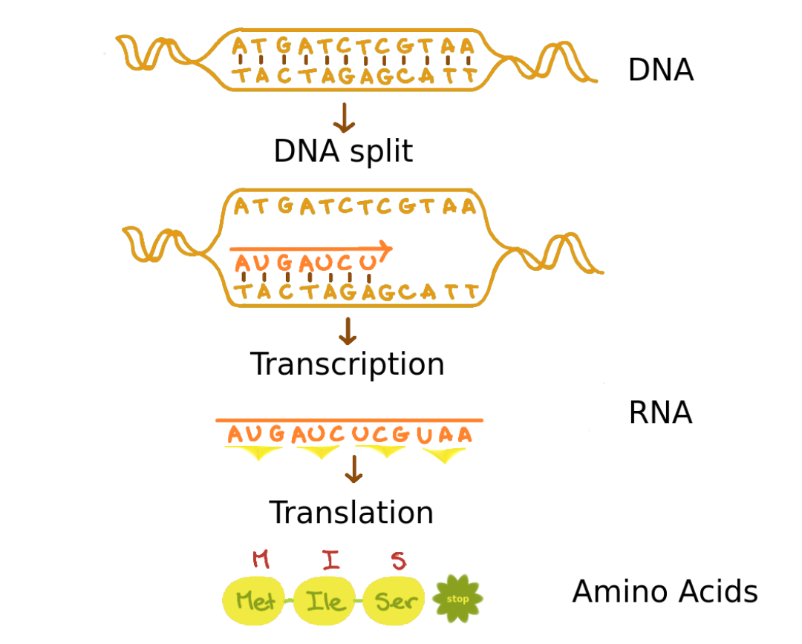

# Introduction to the Bioconductor Project for Data Scientists

**Bioconductor** is to bioinformatics what tidyverse is to data science - an ecosystem of specialized tools for working with biological data. Just as tidyverse provides optimized tools for data manipulation, Bioconductor provides specialized tools for working with genomic data.

## Biological Background (For Data Scientists)

### Understanding the Data Type: What is a Genome?

A **genome** is essentially a very long string with a fixed alphabet of just four characters: A, T, G, and C. Think of it as a base-4 encoding system for biological information, where:
- **A (Adenine)**  
- **T (Thymine)**  
- **G (Guanine)**  
- **C (Cytosine)**  

This might seem like a simple string, but there are key differences from regular text data:
1. The sequence is meaningful in both directions (forward and reverse)
2. The "reading frame" (where you start grouping letters) matters
3. Different regions have different biological functions

### Genome Structure

A genome consists of:
- **Chromosomes** – Large DNA structures containing genes.
- **Genes** – Segments of DNA that code for proteins (some are non-coding but still have functions).
- **Proteins** – Molecules responsible for cellular functions, produced through:
  1. **Transcription**: DNA → RNA
  2. **Translation**: RNA → Protein




### Data Structure: Genome Organization

| Component | Data Analogy | Key Characteristics |
|-----------|--------------|-------------------|
| **Chromosomes** | Files in a database | • Continuous sequence of DNA<br>• Number varies by organism<br>• Humans have 23 chromosome pairs (46 total) |
| **Genes** | Database records | • Specific protein-coding sequences<br>• Contains start/stop signals (like delimiters)<br>• Can be on either DNA strand (bidirectional) |
| **Data Flow** | ETL pipeline | **DNA** → **RNA** → **Protein**<br>*(storage) → (intermediate) → (final product)*<br>• DNA = source data<br>• RNA = transformed intermediate<br>• Proteins = final output |
### Why This Matters for Analysis

When working with genomic data, you'll need to handle these key aspects:

| Operation Type | Analogy | Common Tasks |
|---------------|---------|--------------|
| **Pattern Finding** | Like regex for DNA | • Finding genes in sequences<br>• Identifying regulatory regions<br>• Detecting mutations |
| **Data Transformation** | Like ETL pipeline stages | • DNA to RNA conversion<br>• RNA to protein translation<br>• Reverse complementing sequences |
| **Scale Management** | Like big data processing | • Working with 3B+ character sequences<br>• Managing whole genomes and subsequences<br>• Bidirectional sequence searching |
## Installation and Understanding BSgenome

### Why Special Genome Containers?

Before diving into installation, let's understand why we need specialized genome containers:

| Requirement | Why It Matters | Examples |
|-------------|----------------|-----------|
| **Size and Efficiency** | Genomic data is massive and needs efficient handling | • Human genome: ~3 billion base pairs<br>• Need random access without full loading<br>• Regular R strings would be memory-inefficient |
| **Biological Constraints** | DNA/RNA have strict rules about valid content | • Limited valid characters (ATGC for DNA)<br>• Like validated enums in programming<br>• Built-in validation checks |
| **Common Operations** | Biological operations need specialized optimization | • Finding reverse complements (A↔T, G↔C)<br>• Extracting subsequences (genes)<br>• Pattern matching with biological rules |
### Reference Genomes: Like Standard Datasets

BSgenome provides pre-built genomes, similar to how you might use built-in datasets in R:
- Standard reference sequences for different species
- Quality-controlled and widely used
- Enables reproducible analysis across different studies

### Installation and Setup

```r
# Install BiocManager (think of it as a specialized package manager)
install.packages("BiocManager")

# Install required packages
BiocManager::install(c(
  "GenomicRanges",  # For working with genomic intervals
  "BSgenome",       # For whole genome sequences
  "Biostrings"      # For biological string manipulation
))

# Load the packages
library(GenomicRanges)
library(BSgenome)
library(Biostrings)

# Check your setup
sessionInfo()
```

### Understanding the BSgenome Class

BSgenome uses R's S4 class system (similar to formal object-oriented programming). Think of it as a specialized container with:

```r
# Structure similar to an R6 class or reference class
class(a_genome)       # "BSgenome" - the class type
isS4(a_genome)        # TRUE - uses formal OOP system
slotNames(a_genome)   # Shows available attributes

# Key information stored
show(a_genome)        # Overview (like str() for data frames)
organism(a_genome)    # Which species (e.g., "Homo sapiens")
provider(a_genome)    # Source (e.g., "UCSC")
seqinfo(a_genome)     # Metadata about sequences
```

### Working with Reference Genomes

```r
# List available pre-built genomes
available.genomes()   # Like data() in base R

# Example: Loading yeast genome
library(BSgenome.Scerevisiae.UCSC.sacCer3)
yeast <- BSgenome.Scerevisiae.UCSC.sacCer3

# Exploring the genome structure
length(yeast)         # Number of sequences (chromosomes)
names(yeast)          # Sequence names (like column names)
seqlengths(yeast)     # Sequence lengths (like nchar() for each)
```

## Understanding Biostrings: Working with Biological Sequences

The **Biostrings** package implements algorithms for **fast manipulation of large biological sequences**. It is widely used, with more than 200 Bioconductor packages depending on it.

### Biological String Containers

| Container Type | For Single Sequences | For Multiple Sequences | Purpose |
|----------------|---------------------|----------------------|----------|
| **Basic String** | `BString` | `BStringSet` | Generic large string storage |
| **DNA** | `DNAString` | `DNAStringSet` | DNA sequences (ATGC) |
| **RNA** | `RNAString` | `RNAStringSet` | RNA sequences (AUGC) |
| **Amino Acid** | `AAString` | `AAStringSet` | Protein sequences |

All containers are memory-efficient and optimized for:
- Fast subsetting operations
- Efficient pattern matching
- Biological sequence validation
  
Think of these as specialized string types with built-in biological rules:

```r
# Single sequence containers (like atomic vectors)
DNAString("ATGC")     # DNA sequence
RNAString("AUGC")     # RNA sequence
AAString("MGLT")      # Protein/Amino Acid sequence

# Multiple sequence containers (like lists of strings)
DNAStringSet()        # Multiple DNA sequences
RNAStringSet()        # Multiple RNA sequences
AAStringSet()         # Multiple protein sequences
```

### Biostring Alphabets
Biological sequences follow **predefined alphabets**:
- `DNA_BASES` – A, C, G, T
- `RNA_BASES` – A, C, G, U (U replaces T in RNA)
- `AA_STANDARD` – 20 standard amino acid letters

Additional predefined alphabets include:
- `DNA_ALPHABET` and `RNA_ALPHABET` – Includes **IUPAC_CODE_MAP** (allows ambiguity codes like N for any base).
- `AA_ALPHABET` – Based on **AMINO_ACID_CODE**.

For more details on IUPAC DNA codes, visit: [UCSC Genome IUPAC Codes](http://genome.ucsc.edu/goldenPath/help/iupac.html).


### Biological Data Transformations

DNA → RNA → Protein is like an ETL pipeline.

* **Transcription (DNA to RNA):** In transcription, DNA is converted into RNA by replacing **T** with **U**.
* **Translation (RNA to Amino Acids):** To translate RNA into **Amino Acids**, we use `translate()`.

```r
# Create a DNA sequence (source data)
dna_seq <- DNAString("ATGATCTCGTAA")
dna_seq              
# Output: 12-letter DNAString object
# seq: ATGATCTCGTAA

# Transform to RNA (intermediate format)
rna_seq <- RNAString(dna_seq)
rna_seq              
# Output: 12-letter RNAString object
# seq: AUGAUCUCGUAA

# Transform to Protein (final output)
# Each 3 letters become 1 amino acid
aa_seq <- translate(rna_seq)
aa_seq               
# Output: 4-letter AAString object
# seq: MIS*  (* is a stop signal)

# Shortcut: DNA to Amino Acids
translate(dna_seq)
```

### Working with Sequence Sets

Like working with lists or data frame columns, but optimized for biological sequences:

```r
# Read multiple sequences (like reading rows from CSV)
zikaVirus <- readDNAStringSet("data/zika.fa")

# Understanding the structure
length(zikaVirus)    # Number of sequences (like nrow)
width(zikaVirus)     # Length of each sequence (like nchar)

# Converting between single and multiple sequences
# Like rbind/unlist operations
single_seq <- unlist(zikaVirus)    # Set to single sequence
seq_set <- DNAStringSet(single_seq, 
                       start = c(1, 101, 201),  # Like window functions
                       end = c(100, 200, 300))  # Creating overlapping views
```

Note the difference between `length()` and `width()`:
- For sets: `length()` gives number of sequences, `width()` gives sequence lengths
- For single sequences: only `length()` is applicable, giving sequence length


### Sequence Manipulation Operations

DNA naturally exists as two complementary strands (A pairs with T, G pairs with C). Biostrings efficiently stores just one strand and can computationally derive the other when needed:

```r
dna_seq <- DNAString("ATGATCTCGTAA")

# Get complementary sequence (A↔T, G↔C pairing)
# Like encoding/decoding with fixed rules
complement(dna_seq)    # Returns: TACTAGAGCATT

# Reverse a sequence (right to left)
# Often needed because DNA can be read in both directions
reverse(dna_seq)       # Returns: AATGCTCTAGTA

# Common operation: get reverse complement
# Like getting the other side of the DNA strand
reverseComplement(dna_seq)    # Returns: TTACGAGATCAT
```

### Function Summary Table

| Function | Description | Single Sequence | Set |
|----------|-------------|-----------------|-----|
| `length()` | Returns sequence length or number of sequences in set | Yes (sequence length) | Yes (number of sequences) |
| `width()` | Number of characters per sequence | No | Yes |
| `unlist()` | Collates set elements into single sequence | No | Yes |
| `complement()` | Returns paired DNA strand | Yes | Yes |
| `rev()` | Reorders sequences (bottom to top) for sets; same as reverse() for single | Yes | Yes |
| `reverse()` | Changes sequence order (right to left) | Yes | Yes |
| `reverseComplement()` | Combines reverse and complement operations efficiently | Yes | Yes |

### Performance and Best Practices

1. **Use `reverseComplement()` for Efficiency**
   - When you need both operations, use `reverseComplement()` instead of separate `reverse()` and `complement()`
   - This is particularly important for large sequences as it's optimized for memory and speed

2. **Choosing Between Single Sequences and Sets**
   - Use single sequences when working with one continuous sequence
   - Use sets when you need to:
     - Store multiple related sequences
     - Break a sequence into chunks for parallel processing
     - Compare multiple sequence variants

3. **Memory Considerations**
   - StringSets can hold sequences of different lengths
   - For very large sequences, work with subsequences using `subseq()` to manage memory
   - Use `width()` to check sequence lengths before operations that might be memory-intensive


## Pattern Matching in Biological Sequences

### Why Pattern Matching Matters in Biology

| Purpose | What We're Looking For | Why It's Important |
|---------|----------------------|-------------------|
| **Finding Functional Elements** | • Start/stop signals for genes<br>• Protein binding sites<br>• Regulatory sequences | Control points where biological<br>activity is initiated or regulated |
| **Identifying Variations** | • Mutations in sequences<br>• Genetic variants<br>• Disease-causing changes | Understanding differences that<br>can impact biological function |
| **Discovering Sequence Motifs** | • Repeated functional patterns<br>• Evolutionary conserved sequences<br>• DNA/RNA structural elements | Finding common patterns that<br>indicate important biological roles |

### Pattern Matching Operations

```r
# Basic pattern search (like grep, but biologically aware)
matchPattern(pattern = "ACATGGGCCT", 
            subject = zikaVirus_seq,
            max.mismatch = 1)  # Allow 1 difference (mutation)

# Results show where matches occur:
# Views on a 10794-letter DNAString subject
# start end width [sequence]
# [1] 8561 8580    20 [ACATGGGCCTACCATGGGAG]

# Search in multiple sequences
vmatchPattern(pattern = "ACATGGGCCT", 
             subject = zikaSet,
             max.mismatch = 1)

# Finding palindromes (biologically important!)
palindromes <- findPalindromes(zikaVirus_seq)
```

### Why Care About Palindromes?

In biology, palindromes aren't just curiosities - they're functional elements:

1. **Restriction Sites**
   ```
   Forward:    5'-GAATTC-3'
   Reverse:    3'-CTTAAG-5'
   ```
   - Where enzymes cut DNA
   - Used in genetic engineering
   - Like delimiters in text processing

2. **Protein Binding Sites**
   ```
   TATATAT
   ATATATA
   ```
   - Where regulatory proteins attach
   - Control gene expression
   - Like "keywords" in biological text

### Reading Frames: A Unique Aspect of Biological Sequences

Unlike text, DNA is read in groups of three (codons) and can be read in six different ways:

```r
# Generate all possible reading frames
frames <- DNAStringSet(c(
    subseq(seq, start = 1),      # Frame 1: 123|123|123
    subseq(seq, start = 2),      # Frame 2: 12|312|312
    subseq(seq, start = 3),      # Frame 3: 1|231|231
    reverseComplement(seq)        # Same 3 frames on opposite strand
))

# Why this matters:
# - Different frames produce different proteins
# - Real genes could be in any frame
# - Must check all possibilities
```

### Pattern Matching Parameters to Know

1. **Exact vs. Approximate Matching**
   - `max.mismatch`: Allow differences (mutations)
   - `min.mismatch`: Require minimum differences
   - `with.indels`: Allow insertions/deletions

2. **Search Scope**
   - Search in one or multiple sequences
   - Search in specific regions
   - Search in all reading frames

### Practical Applications

1. **Finding Genes**
   ```r
   # Look for start codon (ATG) followed by stop codons
   starts <- matchPattern("ATG", genome)
   stops <- c("TAA", "TAG", "TGA")
   # Then analyze distances between starts and stops
   ```

2. **Mutation Analysis**
   ```r
   # Look for known sequence with possible mutations
   matches <- matchPattern(
     pattern = known_sequence,
     subject = patient_sequence,
     max.mismatch = 3  # Allow up to 3 mutations
   )
   ```

3. **Regulatory Element Search**
   ```r
   # Look for binding sites with some flexibility
   binding_sites <- vmatchPattern(
     pattern = "TATAAA",  # Common regulatory sequence
     subject = promoter_regions,
     max.mismatch = 1
   )
   ```

---

## **Working with FASTQ Files**

### **Understanding FASTQ Files**

Required packages for this section:
```r
library(ShortRead)
library(tidyverse)  # For data manipulation and plotting
```
FASTQ is the standard format for storing both biological sequence data (like DNA or RNA) and its corresponding quality scores. Each entry in a FASTQ file consists of four lines:

```
@SRR1971253.1 (Sequence identifier)
ATGCTAGCTGATCG (The actual sequence)
+ (A separator line, sometimes contains the identifier again)
IIIHGFEDCBA98 (Quality scores encoded as ASCII characters)
```

The quality scores tell us how confident the sequencing machine was about each base (A, T, G, or C) it read. This is crucial because:
- Sequencing isn't perfect - machines can make mistakes
- Some parts of sequences are harder to read than others
- We need to know which parts of our data we can trust

### **Basic FASTQ Operations**
```r
# Read a FASTQ file
fqsample <- readFastq(dirPath = "data", pattern = "SRR1971253.fastq")

# Examine basic information
fqsample  # Shows number of sequences and length
class(fqsample)  # Should be "ShortReadQ"
sread(fqsample)  # Check reads of fqsample
class(sread(fqsample))  # DNAStringSet - specialized for DNA sequences
id(fqsample)  # Shows sequence identifiers
```

For large files, working with a subset is useful for initial checks:
```r
# Set reproducible sampling
set.seed(1234)

# Sample 100 reads
f <- "data/SRR1971253.fastq"  # Define FASTQ file path
fs <- FastqSampler(con = f, n = 100)
my_sample <- yield(fs)
```

### **Quality Assessment and Control**

Quality scores indicate how reliable each base call is:
- Q10: 1 error per 10 bases (90% Accuracy)
- Q20: 1 error per 100 bases (99% Accuracy)
- Q30: 1 error per 1000 bases (99.9% Accuracy)

```r
# Check base quality scores
quality(fqsample)  # Shows encoded quality for each base
quality(fqsample)[1] # Quality is represented with ASCII characters

## Convert ASCII to numeric quality scores for analysis
pq <- PhredQuality(quality(fqsample))
qs <- as(pq,"IntegerList") # transform encoding into scores
qs # print scores - easier to work with numeric values

# Identify encoding scheme used 
encoding(quality(fqsample))  # Different machines use different encodings

# Perform comprehensive quality assessment
qaSummary <- qa(fqsample, type = "fastq", lane = 1)

# Available QA metrics
names(qaSummary)
# [1] "readCounts" "baseCalls" "readQualityScore" "baseQuality"
# [5] "alignQuality" "frequentSequences" "sequenceDistribution" "perCycle"
# [9] "perTile" "adapterContamination"

# Look at specific quality metrics
qaSummary[['baseQuality']]

# Get a HTML report
browseURL(report(qaSummary))
```

### **Processing and Filtering**

Several types of filters help clean and prepare sequence data for analysis.

#### **Quality-Based Filtering**
Remove reads with low average quality:
```r
# Filter by quality score
qf <- srFilter(function(x) {
    quals <- as(quality(x), "matrix")
    rowMeans(quals) >= 20  # Keep reads with mean quality ≥ 20
})
filtered_reads <- fqsample[qf(fqsample)]

# Check how many reads passed filter
length(filtered_reads)
```

#### **Filtering Unknown Bases**
Remove reads with too many N's (unknown bases) or based on id filtering:
```r
# Create N filter with threshold of 10
nf <- nFilter(threshold = 10, .name = "cleanNFilter")

# Apply to existing reads
filtered_n <- fqsample[nf(fqsample)]

#id filter example
myFilterID <- idFilter(regex = ":3:1") 
# will return only those ids that contain the regular expression
```

#### **Poly-Nucleotide Filtering (polynFilter)**
Remove sequences with long runs of single nucleotides:
```r
# Filter sequences with > 10 consecutive A's
filtered_polyA <- fqsample[polynFilter(threshold = 10, nuc = c("A"))(fqsample)]
```

#### **Duplicate Handling**

Handle duplicate reads:
```r
# Check for duplicates
table(srduplicated(fqsample))  # See how many duplicates exist

# Remove duplicates if needed
unique_reads <- fqsample[!srduplicated(fqsample)]  # Keeps only unique reads
```

#### **Saving Filtered Data**
Save the processed reads:
```r
# Define final cleaned dataset before saving
final_filtered_reads <- unique_reads  # Ensure all filters have been applied
writeFastq(final_filtered_reads, file = "filtered_q20_clean.fastq.gz")
```

### **Next Steps**
After quality control and filtering, the data is ready for:
- Alignment to reference sequences
- Assembly into longer sequences
- Variant identification
- Expression analysis

Each of these analyses has specialized packages and workflows in Bioconductor.

---

## Quality Control with the Rqc Package

The Rqc package from Bioconductor is a Quality Control Tool for High-Throughput Sequencing Data that performs parallel processing of files to assess their quality. It's particularly powerful when dealing with multiple sequence files simultaneously.

### Loading the Package

```r
library(Rqc)
```

### Core Dependencies

The package builds upon several fundamental Bioconductor packages:
- **Basic packages**: Biostrings, IRanges, methods, S4vectors
- **Advanced packages**: Rsamtools, GenomicAlignments, GenomicFiles, BiocParallel
- **CRAN packages**: knitr, dplyr, markdown, ggplot2, digest, shiny, and Rcpp

### Quality Assessment with rqcQA

#### Basic Usage
```r
# Basic quality assessment
qaRqc <- rqcQA(files, workers = 4)

# With sampling
set.seed(1111)
qaRqc_sample <- rqcQA(files, 
                      workers = 4,    # Number of parallel workers
                      sample = TRUE,  # Enable sampling
                      n = 500)        # Sample size

# For paired-end files
pfiles <- c("data/seq1_1.fq", "data/seq1_2.fq",
            "data/seq2_1.fq", "data/seq2_2.fq")
qaRqc_paired <- rqcQA(pfiles, 
                      workers = 4, 
                      pair = c(1, 1, 2, 2))  # Group files by pairs
```

#### Generating Reports
```r
# Create report with custom template
reportFile <- rqcReport(qaRqc, templateFile = "myReport.Rmd")
browseURL(reportFile)
```

### Plot Functions Reference

| Category | Function Name | Description |
|----------|--------------|-------------|
| **Cycle Analysis** | `rqcCycleAverageQualityPcaPlot()` | PCA of cycle average quality |
| | `rqcCycleAverageQualityPlot()` | Average quality per cycle |
| | `rqcCycleBaseCallsLinePlot()` | Base calls distribution (line) |
| | `rqcCycleBaseCallsPlot()` | Base calls distribution (bar) |
| | `rqcCycleGCPlot()` | GC content per cycle |
| | `rqcCycleQualityBoxPlot()` | Quality distribution per cycle (box) |
| **Read Analysis** | `rqcGroupCycleAverageQualityPlot()` | Group-based quality analysis |
| | `rqcReadQualityBoxPlot()` | Read quality distribution (box) |
| | `rqcReadQualityPlot()` | Overall read quality distribution |
| | `rqcReadWidthPlot()` | Read length distribution |
| | `rqcReadFrequencyPlot()` | Read frequency analysis |
| **Cycle Quality** | `rqcCycleQualityPlot()` | Quality scores per cycle |

### File Information Display

Use `perFileInformation()` to get a summary of your sequence files:

```r
perFileInformation(qaRqc)
```

Example output:
```
filename          pair format group reads total.reads path
SRR7760274.fastq  1    FASTQ  None  1e+06 2404795    ./data
SRR7760275.fastq  2    FASTQ  None  1e+06 1508139    ./data
SRR7760276.fastq  3    FASTQ  None  1e+06 1950463    ./data
SRR7760277.fastq  4    FASTQ  None  1e+06 2629588    ./data
```
---

## **Conclusion**
This document introduces Bioconductor, **BSgenome**, and **Biostrings** for working with genome sequences. 
For further exploration, check out:

🔗 [Bioconductor Website](https://bioconductor.org/)