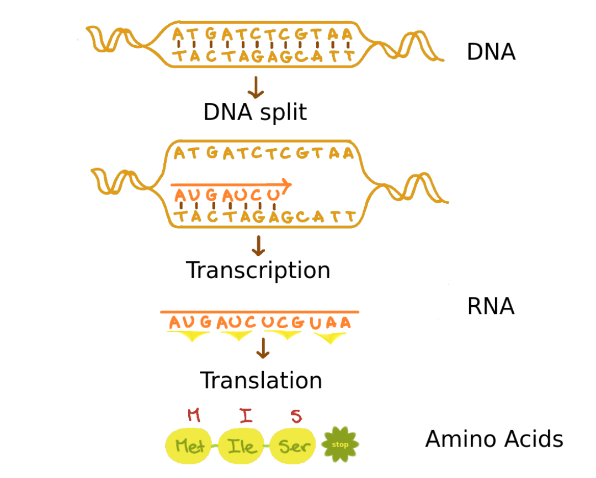

# Introduction to the Bioconductor Project for Data Scientists

**Bioconductor** is to bioinformatics what tidyverse is to data science - an ecosystem of specialized tools for working with biological data. Just as tidyverse provides optimized tools for data manipulation, Bioconductor provides specialized tools for working with genomic data.

## Biological Background (For Data Scientists)

### Understanding the Data Type: What is a Genome?

A **genome** is essentially a very long string with a fixed alphabet of just four characters: A, T, G, and C. Think of it as a base-4 encoding system for biological information, where:
- **A (Adenine)**  
- **T (Thymine)**  
- **G (Guanine)**  
- **C (Cytosine)**  

This might seem like a simple string, but there are key differences from regular text data:
1. The sequence is meaningful in both directions (forward and reverse)
2. The "reading frame" (where you start grouping letters) matters
3. Different regions have different biological functions

### Genome Structure

A genome consists of:
- **Chromosomes** – Large DNA structures containing genes.
- **Genes** – Segments of DNA that code for proteins (some are non-coding but still have functions).
- **Proteins** – Molecules responsible for cellular functions, produced through:
  1. **Transcription**: DNA → RNA
  2. **Translation**: RNA → Protein




### Data Structure: Genome Organization

Think of a genome's organization like this:

1. **Chromosomes**: Like separate files in a database
   - Each chromosome is a continuous sequence
   - Different organisms have different numbers of chromosomes
   - In humans: 23 pairs of chromosomes (46 total)

2. **Genes**: The "records" we're often trying to find
   - Specific sequences that code for proteins
   - Have start and stop signals (like delimiters in text)
   - Can be on either strand of DNA (forward or reverse)

3. **Data Flow**: The Central Dogma of Biology
   ```
   DNA → RNA → Protein
   (storage) (intermediate) (functional molecule)
   ```
   This is similar to an ETL pipeline:
   - DNA is like source data
   - RNA is like transformed intermediate data
   - Proteins are the final "output"

### Why This Matters for Analysis

When working with genomic data, you'll often need to:
1. **Find Patterns**: Like regex for DNA
   - Finding genes in a sequence
   - Identifying regulatory regions
   - Detecting mutations

2. **Transform Data**: Between different formats
   - DNA to RNA conversion
   - RNA to protein translation
   - Reverse complementing sequences

3. **Handle Scale**: Efficient data structures
   - Human genome: ~3 billion characters
   - Must handle both whole genomes and subsequences
   - Need to search in both directions

## Installation and Understanding BSgenome

### Why Special Genome Containers?

Before diving into installation, let's understand why we need specialized genome containers:

1. **Size and Efficiency**
   - A human genome has ~3 billion base pairs
   - Regular R strings would be memory-inefficient
   - Need random access to specific regions without loading entire sequence

2. **Biological Constraints**
   - Like having a validated enum in programming
   - Only certain characters are valid (ATGC for DNA)
   - Built-in checks prevent invalid sequences

3. **Common Operations**
   - Finding reverse complements (like A↔T, G↔C pairing)
   - Extracting subsequences (like getting specific genes)
   - These are optimized in specialized containers

### Reference Genomes: Like Standard Datasets

BSgenome provides pre-built genomes, similar to how you might use built-in datasets in R:
- Standard reference sequences for different species
- Quality-controlled and widely used
- Enables reproducible analysis across different studies

### Installation and Setup

```r
# Install BiocManager (think of it as a specialized package manager)
install.packages("BiocManager")

# Install required packages
BiocManager::install(c(
  "GenomicRanges",  # For working with genomic intervals
  "BSgenome",       # For whole genome sequences
  "Biostrings"      # For biological string manipulation
))

# Load the packages
library(GenomicRanges)
library(BSgenome)
library(Biostrings)

# Check your setup
sessionInfo()
```

### Understanding the BSgenome Class

BSgenome uses R's S4 class system (similar to formal object-oriented programming). Think of it as a specialized container with:

```r
# Structure similar to an R6 class or reference class
class(a_genome)       # "BSgenome" - the class type
isS4(a_genome)        # TRUE - uses formal OOP system
slotNames(a_genome)   # Shows available attributes

# Key information stored
show(a_genome)        # Overview (like str() for data frames)
organism(a_genome)    # Which species (e.g., "Homo sapiens")
provider(a_genome)    # Source (e.g., "UCSC")
seqinfo(a_genome)     # Metadata about sequences
```

### Working with Reference Genomes

```r
# List available pre-built genomes
available.genomes()   # Like data() in base R

# Example: Loading yeast genome
library(BSgenome.Scerevisiae.UCSC.sacCer3)
yeast <- BSgenome.Scerevisiae.UCSC.sacCer3

# Exploring the genome structure
length(yeast)         # Number of sequences (chromosomes)
names(yeast)          # Sequence names (like column names)
seqlengths(yeast)     # Sequence lengths (like nchar() for each)
```

## Understanding Biostrings: Working with Biological Sequences

The **Biostrings** package implements algorithms for **fast manipulation of large biological sequences**. It is widely used, with more than 200 Bioconductor packages depending on it.

### Biological String Containers
Biological sequences in Biostrings are stored in **memory-efficient containers**, which allow efficient subsetting and pattern matching. The containers include:
- `BString` – Stores a generic big string.
- `DNAString` – Stores DNA sequences.
- `RNAString` – Stores RNA sequences.
- `AAString` – Stores amino acid sequences.

To store **multiple sequences**, we use **StringSet containers**:
- `BStringSet`
- `DNAStringSet`
- `RNAStringSet`
- `AAStringSet`

Think of these as specialized string types with built-in biological rules:

```r
# Single sequence containers (like atomic vectors)
DNAString("ATGC")     # DNA sequence
RNAString("AUGC")     # RNA sequence
AAString("MGLT")      # Protein/Amino Acid sequence

# Multiple sequence containers (like lists of strings)
DNAStringSet()        # Multiple DNA sequences
RNAStringSet()        # Multiple RNA sequences
AAStringSet()         # Multiple protein sequences
```

### Biostring Alphabets
Biological sequences follow **predefined alphabets**:
- `DNA_BASES` – A, C, G, T
- `RNA_BASES` – A, C, G, U (U replaces T in RNA)
- `AA_STANDARD` – 20 standard amino acid letters

Additional predefined alphabets include:
- `DNA_ALPHABET` and `RNA_ALPHABET` – Includes **IUPAC_CODE_MAP** (allows ambiguity codes like N for any base).
- `AA_ALPHABET` – Based on **AMINO_ACID_CODE**.

For more details on IUPAC DNA codes, visit: [UCSC Genome IUPAC Codes](http://genome.ucsc.edu/goldenPath/help/iupac.html).


### Biological Data Transformations

DNA → RNA → Protein is like an ETL pipeline.

* **Transcription (DNA to RNA):** In transcription, DNA is converted into RNA by replacing **T** with **U**.
* **Translation (RNA to Amino Acids):** To translate RNA into **Amino Acids**, we use `translate()`.

```r
# Create a DNA sequence (source data)
dna_seq <- DNAString("ATGATCTCGTAA")
dna_seq              
# Output: 12-letter DNAString object
# seq: ATGATCTCGTAA

# Transform to RNA (intermediate format)
rna_seq <- RNAString(dna_seq)
rna_seq              
# Output: 12-letter RNAString object
# seq: AUGAUCUCGUAA

# Transform to Protein (final output)
# Each 3 letters become 1 amino acid
aa_seq <- translate(rna_seq)
aa_seq               
# Output: 4-letter AAString object
# seq: MIS*  (* is a stop signal)

# Shortcut: DNA to Amino Acids
translate(dna_seq)
```

### Working with Sequence Sets

Like working with lists or data frame columns, but optimized for biological sequences:

```r
# Read multiple sequences (like reading rows from CSV)
zikaVirus <- readDNAStringSet("data/zika.fa")

# Understanding the structure
length(zikaVirus)    # Number of sequences (like nrow)
width(zikaVirus)     # Length of each sequence (like nchar)

# Converting between single and multiple sequences
# Like rbind/unlist operations
single_seq <- unlist(zikaVirus)    # Set to single sequence
seq_set <- DNAStringSet(single_seq, 
                       start = c(1, 101, 201),  # Like window functions
                       end = c(100, 200, 300))  # Creating overlapping views
```

Note the difference between `length()` and `width()`:
- For sets: `length()` gives number of sequences, `width()` gives sequence lengths
- For single sequences: only `length()` is applicable, giving sequence length


### Sequence Manipulation Operations

DNA naturally exists as two complementary strands (A pairs with T, G pairs with C). Biostrings efficiently stores just one strand and can computationally derive the other when needed:

```r
dna_seq <- DNAString("ATGATCTCGTAA")

# Get complementary sequence (A↔T, G↔C pairing)
# Like encoding/decoding with fixed rules
complement(dna_seq)    # Returns: TACTAGAGCATT

# Reverse a sequence (right to left)
# Often needed because DNA can be read in both directions
reverse(dna_seq)       # Returns: AATGCTCTAGTA

# Common operation: get reverse complement
# Like getting the other side of the DNA strand
reverseComplement(dna_seq)    # Returns: TTACGAGATCAT
```

### Function Summary Table

| Function | Description | Single Sequence | Set |
|----------|-------------|-----------------|-----|
| `length()` | Returns sequence length or number of sequences in set | Yes (sequence length) | Yes (number of sequences) |
| `width()` | Number of characters per sequence | No | Yes |
| `unlist()` | Collates set elements into single sequence | No | Yes |
| `complement()` | Returns paired DNA strand | Yes | Yes |
| `rev()` | Reorders sequences (bottom to top) for sets; same as reverse() for single | Yes | Yes |
| `reverse()` | Changes sequence order (right to left) | Yes | Yes |
| `reverseComplement()` | Combines reverse and complement operations efficiently | Yes | Yes |

### Performance and Best Practices

1. **Use `reverseComplement()` for Efficiency**
   - When you need both operations, use `reverseComplement()` instead of separate `reverse()` and `complement()`
   - This is particularly important for large sequences as it's optimized for memory and speed

2. **Choosing Between Single Sequences and Sets**
   - Use single sequences when working with one continuous sequence
   - Use sets when you need to:
     - Store multiple related sequences
     - Break a sequence into chunks for parallel processing
     - Compare multiple sequence variants

3. **Memory Considerations**
   - StringSets can hold sequences of different lengths
   - For very large sequences, work with subsequences using `subseq()` to manage memory
   - Use `width()` to check sequence lengths before operations that might be memory-intensive


## Pattern Matching in Biological Sequences

### Why Pattern Matching Matters in Biology

Unlike regular text analysis, pattern matching in genomic data serves specific biological purposes:

1. **Finding Functional Elements**
   - Start/stop signals for genes
   - Binding sites for proteins
   - Regulatory sequences that control gene activity

2. **Identifying Variations**
   - Mutations in sequences
   - Genetic variants
   - Disease-causing changes

3. **Discovering Sequence Motifs**
   - Repeated patterns with biological function
   - Evolutionary conserved sequences
   - Structural elements in DNA/RNA

### Pattern Matching Operations

```r
# Basic pattern search (like grep, but biologically aware)
matchPattern(pattern = "ACATGGGCCT", 
            subject = zikaVirus_seq,
            max.mismatch = 1)  # Allow 1 difference (mutation)

# Results show where matches occur:
# Views on a 10794-letter DNAString subject
# start end width [sequence]
# [1] 8561 8580    20 [ACATGGGCCTACCATGGGAG]

# Search in multiple sequences
vmatchPattern(pattern = "ACATGGGCCT", 
             subject = zikaSet,
             max.mismatch = 1)

# Finding palindromes (biologically important!)
palindromes <- findPalindromes(zikaVirus_seq)
```

### Why Care About Palindromes?

In biology, palindromes aren't just curiosities - they're functional elements:

1. **Restriction Sites**
   ```
   Forward:    5'-GAATTC-3'
   Reverse:    3'-CTTAAG-5'
   ```
   - Where enzymes cut DNA
   - Used in genetic engineering
   - Like delimiters in text processing

2. **Protein Binding Sites**
   ```
   TATATAT
   ATATATA
   ```
   - Where regulatory proteins attach
   - Control gene expression
   - Like "keywords" in biological text

### Reading Frames: A Unique Aspect of Biological Sequences

Unlike text, DNA is read in groups of three (codons) and can be read in six different ways:

```r
# Generate all possible reading frames
frames <- DNAStringSet(c(
    subseq(seq, start = 1),      # Frame 1: 123|123|123
    subseq(seq, start = 2),      # Frame 2: 12|312|312
    subseq(seq, start = 3),      # Frame 3: 1|231|231
    reverseComplement(seq)        # Same 3 frames on opposite strand
))

# Why this matters:
# - Different frames produce different proteins
# - Real genes could be in any frame
# - Must check all possibilities
```

### Pattern Matching Parameters to Know

1. **Exact vs. Approximate Matching**
   - `max.mismatch`: Allow differences (mutations)
   - `min.mismatch`: Require minimum differences
   - `with.indels`: Allow insertions/deletions

2. **Search Scope**
   - Search in one or multiple sequences
   - Search in specific regions
   - Search in all reading frames

### Practical Applications

1. **Finding Genes**
   ```r
   # Look for start codon (ATG) followed by stop codons
   starts <- matchPattern("ATG", genome)
   stops <- c("TAA", "TAG", "TGA")
   # Then analyze distances between starts and stops
   ```

2. **Mutation Analysis**
   ```r
   # Look for known sequence with possible mutations
   matches <- matchPattern(
     pattern = known_sequence,
     subject = patient_sequence,
     max.mismatch = 3  # Allow up to 3 mutations
   )
   ```

3. **Regulatory Element Search**
   ```r
   # Look for binding sites with some flexibility
   binding_sites <- vmatchPattern(
     pattern = "TATAAA",  # Common regulatory sequence
     subject = promoter_regions,
     max.mismatch = 1
   )
   ```

---

## **Conclusion**
This document introduces Bioconductor, **BSgenome**, and **Biostrings** for working with genome sequences. 
For further exploration, check out:

🔗 [Bioconductor Website](https://bioconductor.org/)
